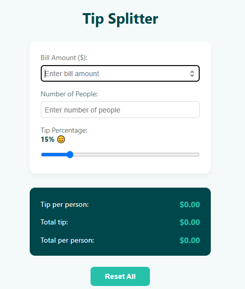

# 💸 Tip Splitter Aplikacija

Jednostavna aplikacija za brzo deljenje računa i napojnice između više osoba.

## Funkcionalnosti

- Unos iznosa računa i broja osoba
- Klizač za izbor procenta napojnice
- Automatski proračun:
  - Ukupne napojnice
  - Napojnice po osobi
  - Ukupnog iznosa po osobi
- Vizuelni prikaz emotikona u zavisnosti od visine napojnice
- Prikaz grešaka za nevažeće unose
- Dugme za resetovanje forme

## Izgled aplikacije

## Korišćene tehnologije

- HTML5
- CSS3
- JavaScript (Vanilla JS)
